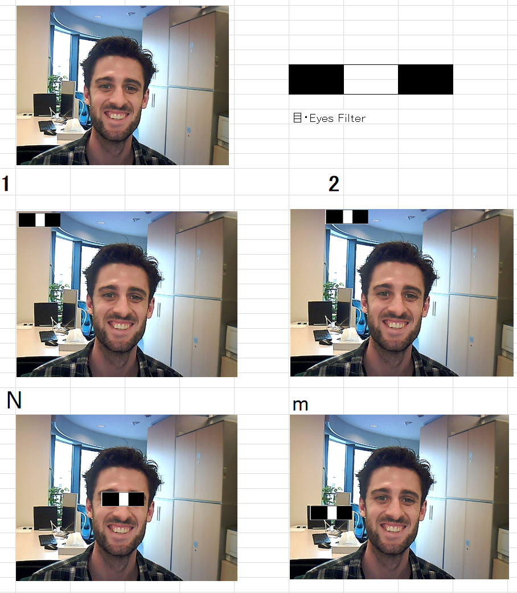
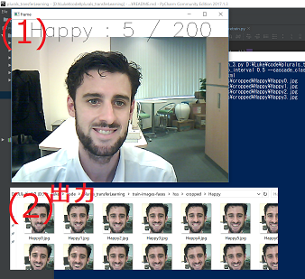
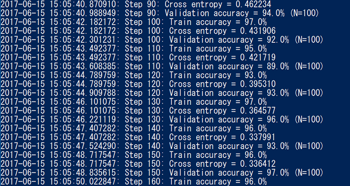

# 画像認識
# 日本語

## NEURAL NETWORK

画像認識はConvoluted Neural Network（CNN）というアルゴリズムを使えば結構きちんと結果ができす。　ですので今月の勉強はCNNに関してだった。

## TRANSFER LEARNING

Pre trained models~
TODO

## HAR-CASCADE

Har-cascadeは画像検出ができるアルゴリズムです。Neural Networksに比べてそんなに画像認識ができないんです。  
Neural Networksはたくさん色々な人の顔の写真の中で写真は誰かの顔どうじて分けることまでできて素晴らしいが, Har-cascadeは画像の中に顔があるかどうか、どこにあることまで分かることがでくる。 だけど、それも使えることです. データのデータクリーニングで, 顔の場所だけ分かったらだけなら便利だから, それ使う.  

一つのHar-FilterはWeak Filterです。Weakの意味は、ぎりぎり無作為に比べていいです。 だからHar-FilterをCascadeする。（重ねる）　　

始めは一番よく偽陽性がでるHar-filterで、合わない部分を捨てる。  
二回目は、二番目偽陽性が出るFilterを使って、合わない部分を捨てる。  
繰り返して  
繰り返す。  
最後のところは、もっと強いFilterでする。あのFilterはもちろん遅いが、残り部分は少なくてきたから大丈夫はずです。



1と２には、フィルターと写真の部分は似合わない。Nに、するべきように似合うです。Mには、間違って似合うです。Mのことがあるから、Har-Filterはたくさん重ねにゃくちゃいけないと。


****************

## TENSORFLOW

TensorFlowはGoogleに作られたAIのAPIです。TensorFlowでAPIのことはもっと簡単に作られそうです。TensorFlowは結構新しいけど早く人気になっている。TensorFlowはCPUかNVIDIA　CUDAで仕事ができる。
Tensorflowの中でたくさん人気や便利AIやMachine Learningアルゴリズムもう作られたから早く自分のプロジェクトで使える。あと、自分のアルゴリズムもう、Frameworkで書けますから何でもできそうである。

### TENSORFLOW INSTALLATION

Windowsの場合、Python3.5が必要である。Python2.7は使えないことです。
1. Python 3.5
2. Microsoft Visual C++ 2015 Redistributable Update 3 (x64 version)
3. CUDA 8 			https://developer.nvidia.com/cuda-downloads
  * Windows PATHとCUDAの“Bin”DIRをつなぐ 
4. cuDNN v5.1  		https://developer.nvidia.com/cudnn		
  * cuDNNの.zipの中から
&nbsp;&nbsp;"cuda\bin\cudnn64_5.dll" 　	→　"～\NVIDIA GPU Computing Toolkit\CUDA\v8.0\bin\"  
&nbsp;&nbsp;"cuda\include\cudnn.h" 　	→　"～\NVIDIA GPU Computing Toolkit\CUDA\v8.0\include\"  
&nbsp;&nbsp;"cuda\lib\x64\cudnn.lib" 　	→　"～\NVIDIA GPU Computing Toolkit\CUDA\v8.0\lib\x64\"  
5. Tensorflow
```bash
pip3 install --upgrade tensorflow-gpu
```
Hello　World	：　	
>import tensorflow as tf  
> hello = tf.constant('Hello, TensorFlow!')  
>sess = tf.Session()  
>print(sess.run(hello))  
			
## OPENCV

OpencvはPython2.7のLibraryです。 Opencvで画像やビデオに関して色々なことができます。Machine Learningのことができそうけど、わたしの意見はできるだけTensorflowを使った方がいい. だからOpenCVはウエブカメラからTraining dataを集めるようにだけ使います。  

### OPENCV INSTALLATION

OpenCVはPython2.7のAPIだけど下のURLでPython3で使えるバージョンがあります。
1. python 3: 　http://www.lfd.uci.edu/~gohlke/pythonlibs/#opencv
```bash
pip install opencv_python-3.2.0-cp35-cp35m-win32.whl
```
## ====== Execution ========
1. トレーニングデータほ作る。

   ```bash
   python PhotoAcquisition_3.py D:\Luke\code\plurals_transferLearning\train-images-faces\hss Happy Sad Scared --number_of_samples 200 --photo_interval 0.5 --har D:\Luke\code\plurals_transferLearning\har-cascaades\haarcascade_frontalface_default.xml
   ```
   ！！　終わってから　「image_dir」をを開きサイズように並べ替えて。それでゴミの画像を消す。
2. 新しいClassification layerを作って、Inceptionの最後に入れる。

    ```bash
    python retrain.py --image_dir D:\Luke\code\plurals_transferLearning\train-images-faces\hss\cropped
    ```

3. 画像を認識する。

    ```bash
    python try-retrain.py D:\Luke\code\plurals_transferLearning\test-images-faces\shiawase.jpg --har D:\Luke\code\plurals_transferLearning\har-cascaades\haarcascade_frontalface_default.xml
    python try-retrain.py D:\Luke\code\plurals_transferLearning\test-images-faces\kanashi.jpg --har D:\Luke\code\plurals_transferLearning\har-cascaades\haarcascade_frontalface_default.xml
    python try-retrain.py D:\Luke\code\plurals_transferLearning\test-images-faces\kowai.jpg --har D:\Luke\code\plurals_transferLearning\har-cascaades\haarcascade_frontalface_default.xml
    ```
## ~ 詳しく説明

### (1) 手動でデータを集まる
- プログラムが理解できてほしいクラスように写真や画像を集めて、会ってるDIRに入れる。 例えば笑顔の写真は「幸せ」というのDIRに入れるが悲し顔は「悲し」というの入れる。
- この仕事はもちろん手動でできるが、"photoAquisition.py"というプログラムでちょっと自動的にできることになりました。
- ！！　終わってから　「image_dir」をを開いて、サイズように並べ替えて。それでゴミの画像を消す。

PhotoAquisition.py の仕方
```bash
python PhotoAcquisition_3.py C:\datasets\test Happy Sad Scared --number_of_samples 100 --photo_interval 0.5
```
2. 上のｃｍｄは指定されたクラス「Happy, Sad, Scared」に応じて百回に半秒ずつ写真を撮って「C:\datasets\test¥｛クラス｝」に保存する。
4. 撮る際して、何の写真を撮るのは画面で書いてあるから、画面ように会ってる顔とこ物を発表してください。
5. 必要に応じて、Har-Classifier（。ｘｍｌ）を指定ができる。その.xmlでプログラムは自動的にトリミングのことができる。

##### Har-Classifierを使う

1. Har-Classifierはネットでダウンロードができます。
2. ”--har {.xmlのDIR}”　をARGに入れる。
3. それでプログラムは自動的にトリミングのことをする.
 - ウエブカメラの前に会ってる物事はないの場合に写真は撮らないことです。つまりプログラムは待ってあげます。だけど、使われたHar-Classifierは弱い時に、問題になるかもしれない。

##### Har-classifierを作り方

 1. www.image-net.org/　で 「negative」 画像 (クラシファをしたい物は入ってない画像ということです). 出来れば1000枚がいい.

    例えば. http://www.image-net.org/api/text/imagenet.synset.geturls?wnid=n09403734

 2. 上のリンクみたいなリンクから"imgnet/neg/links.txt" というファイルで貼り付ける。
 3. TrainHar.py で 「negative」 画像をダウンロードする。

    ```bash
    python TrainHar.py --mode neg
    ```

    (ネットで色々なサイトをめいめい行かないといけないから時間かかる次第です ...)
 4. "imgnet/neg/”を開いて、サイズように並べ替えて。それでゴミの画像を消す。
 5. TrainHar.py でファイルの名前を載る (imgnet/neg/negatives.txt)
    ```
    python TrainHar.py --mode negfiles
    ```
 6. 自分で「Positive」画像や写真を集まる。出来れば白いBGがいいです。６－１５枚ぐらいが足りる。

    １００ｘ１００ｐｘ　以下のを使えないことになっている。

 7. 次はトリミングとサイズをする。
    ```bash
    Clean_Postives.py
    ```
 8. Train.har の　--mode pos　は「Positive」の画像をランダムに回って「negative」の上にを入れる。それでたくさんトレーニングためのイメージを作る。
    ```bash
    python TrainHar.py --mode pos
    ```
    疲れた画像は　"imgnet/traincln/"　に保存した。

 9. Train the har-classifier.

     ??? todo ???

 10. 自分で作ったClassifierの作り方は、上の（Har-Classifierを使う）という見出しどうりです。

    

### (2) Train classification layer

 + Transfer Learningということを使うから、割に時間かからないが、もちろんトレーニングデータがあればあるほど時間かかる。

 1. python retrain.py --image_dir training_images
 2. トレーニングの統計を見方は、下のｃｍｄしてから見える。結果に応じて統計基づいて設定を変更ことができる。
    ```bash
    tensorboard: tensorboard --logdir /temp/retrain_logs
    ```
    (browser) http://localhost:6006

    

### (3) Classify an image

1. Classifierに画像を入れる。（jpeg・Jpegだけです）
    ```bash
    python try-retrain.py test-images\image1.jpg
    ```
2.  結果はクラスずつどのぐらい合うのパーセントです。

    

## ====== Arguments ====
	
### PhotoAcquisition_3.py
トレーニングのため写真を作る  

例　> python PhotoAcquisition_3.py D:\Luke\code\plurals_transferLearning\train-images-faces\hss Happy Sad Scared --number_of_samples 100 --photo_interval 1 --cascade_classifier D:\Luke\code\plurals_transferLearning\har-cascaades\haarcascade_frontalface_default.xml

Arguments:  
+ 保存Dir  
+ クラス  
+ --number_of_samples: クラスずつ何枚写真
+ --photo_interval: 写真を取る間に何分を休む  
+ --har: Har-cascadeのDir

### retrain.py
Classification LayerをトレーニングしてClassification layerを作る。

例　> python retrain.py --image_dir train-images-faces-hss-cropped

Arguments:  
+ --image_dir: トレーニングデータ（サブフォルダはクラスの名前）。
+ --output_graph： グラフを保存するDIR. デフォルトは "../retrain_graph/output_graph.pb"です。
+ --output_labels: グラフのクラスの名前を保存するDIR. デフォルトは'../retrain_graph/output_labels.txt'です。
+ --summaries_dis: TensorLogのためにLOGのファイルのDIR. デフォルトは'../retrain_graph/retrain_logs'です。
+ --how_many_training_steps:トレーニングは何回で終わる　.デフォルトは4000です。
+ --learning_rate:　Learing rateはどのぐらいWeightを変更する、前のIterationのエラーに沿って.　デフォルトは0.1です。
+ --testing_percentage: テストのデータは何％がトレーニングにとして使う.　デフォルトは10です。
+ --validation_percentage: テストのデータは何％がヴァリデーションにとして使う.　デフォルトは10desu。
+ --eval_step_interval: トレーニングとヴァリデーションの間はどのくらいことです .デフォルトは10です。
+ --train_batch_size: .デフォルトは100です。
+ --test_batch_size: .デフォルトは1です。
+ --validation_batch_size: 
+ --print_misclassified_test_images: 
+ --model_dir: 作られたグラフの他のファイルを保存するDIR。デフォルトは'../retrain_graph/imagenet'です。
+ --bottleneck_dir: 。デフォルトは'../retrain_graph/bottleneck'です。
+ --final_tensor_name: 新しい作ったグラフの新しいClassification layerの名前です。デフォルトは'final_result'です。
+ --flip_left_right: トレーニングデータを半分が無作為にミラーイメージさせるかどうか選択です。デフォルトは 0 です (つまりしないことです)
+ --random_scale: トレーニングデータの画像のサイズが何％無作為に大きくする。デフォルトは０パーです。
+ --random_brightness: 無作為に選んだトレーニングデータが画像の明りさを変更する。デフォルトは０パーです。

### try-retrain.py
写真をClassifyする. 入力する写真はどのクラスに一番似合うのを出力です。

例　> python try-retrain.py test-images-faces\image1.jpg

args: 
+ image_path: classifyをしたい画像のDIRです.
+ har:  Har-cascadeのDir (必要はないがトレーニングで使ってたら使った方がいい)